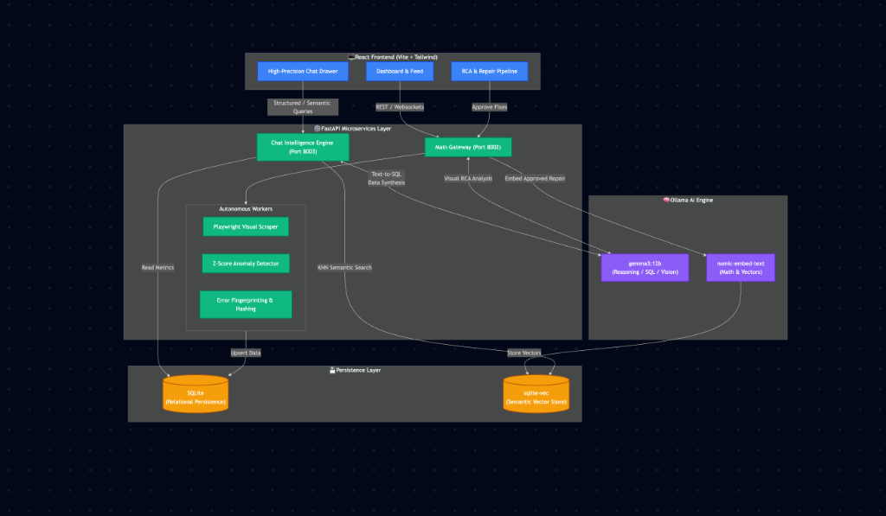

# GemmaWatch - Autonomous Observability Engine

An intelligent, high-precision web monitoring platform powered by Ollama + Gemma for visual regression analysis, autonomous RCA, and real-time observability.

## Current Status

**System Maturity: 100% (Phase 2: High-Precision RAG & Autonomous Learning Completed)**

### ✨ Premium Intelligence Layer
- **High-Precision Analyst Persona**: Professional, data-driven, and concise AI persona (no conversational fluff).
- **Deterministic Entity Recognition**: Instant site-name detection (e.g., "Mark") for 100% accurate SQL routing.
- **Vector-Native RAG (sqlite-vec)**: High-performance semantic search with SQL JOINs for pattern matching.
- **Temporal Grounding**: Real-time server-synchronization for relative temporal SQL queries (e.g., "last 24h").
- **Autonomous Learning Catalogue**: Three-tier knowledge management (Primary, Pending, Shadow) with HITL review.

### 🎨 Premium Design System
- **Obsidian & Emerald Palette**: High-contrast, immersive "Observability" aesthetic.
- **Glassmorphism 2.0**: Three-layered glass system (`glass-thin` to `glass-thick`) with atmospheric noise textures.
- **GPU-Accelerated Micro-Animations**: Staggered entrance transitions and fluid UI interactions.
- **Ambient Visual Feedback**: Pulsing status orbs and dynamic background glows.

### 🛠️ Core Monitoring Features
- **Multi-type Check Engine**: HTTP, REST API, DNS, and TCP monitoring.
- **Visual Regression Detection**: Playwright-powered snapshot comparisons with Gemma-interpreted DOM analysis.
- **Autonomous RCA**: Automatic root cause identification with confidence scoring and structured repair steps.
- **Error Fingerprinting & Grouping**: SHA-256 hashing of normalized errors to deduplicate recurring failure patterns into human-readable incidents.
- **Intelligent Alerting**: Anomaly detection with statistical z-score thresholds, cross-site incident correlation, and email notifications.
- **Autonomous Scheduler**: Background interval-based check engine for all registered sites.

### Architecture



```text
┌─────────────────────────────────────────────────────────────────────────────┐
│                           DATA FLOW SUMMARY                                 │
├─────────────────────────────────────────────────────────────────────────────┤
│                                                                             │
│  1. USER ACTION (Frontend)                                                 │
│     → Click "Run Check" button                                             │
│                                                                             │
│  2. API REQUEST (HTTP POST)                                                │
│     → POST /monitor with site info                                         │
│     → Backend receives request                                             │
│                                                                             │
│  3. MONITORING (Backend)                                                   │
│     → Scraper takes full-page screenshot (Playwright)                      │
│     → Scraper captures DOM, console logs, network errors                   │
│     → Store raw data temporarily                                           │
│                                                                             │
│  4. AI ANALYSIS (Gemma)                                                    │
│     → Send failure details + DOM to Ollama                                 │
│     → Gemma generates Root Cause Analysis (RCA) with structured steps      │
│     → Returns: probable_cause, confidence, repair_action, repair_steps[]   │
│                                                                             │
│  5. ERROR FINGERPRINTING (Async, non-blocking)                             │
│     → Console errors & network failures normalized (timestamps stripped)   │
│     → SHA-256 hash computed per unique error pattern                       │
│     → Pattern upserted to error_fingerprints table (deduplication)         │
│     → Gemma generates human-readable title & description for new patterns  │
│     → Check linked to matching fingerprints in check_fingerprints table    │
│                                                                             │
│  6. DATABASE STORAGE (SQLite)                                              │
│     → Save check result (status, screenshot, timestamp)                    │
│     → Save RCA data (confidence score, structured repair steps)            │
│     → Save error details (console logs, network errors as JSON)            │
│     → Save metrics (response time, error counts)                           │
│     → High-confidence RCA entered into HITL Catalogue pipeline             │
│                                                                             │
│  7. POST-CHECK INTELLIGENCE PIPELINE (Async)                               │
│     → Anomaly detection: z-score analysis on response time & DOM counts    │
│     → Gemma interprets statistical anomalies (severity classification)     │
│     → Cross-site correlation: creates Incidents on multi-site failures     │
│     → Alert service: sends email on consecutive failures or anomalies      │
│                                                                             │
│  8. REAL-TIME BROADCAST (WebSocket)                                        │
│     → Send result to frontend via ws://localhost:8002/ws/status            │
│     → Frontend updates dashboard in real-time                              │
│     → User sees fingerprints, RCA, screenshots, error details immediately  │
│                                                                             │
│  9. HISTORY RETRIEVAL                                                      │
│     → User selects site from list                                          │
│     → GET /sites/{site_id}/history?limit=50                                │
│     → Backend queries SQLite, joins root_causes + fingerprints tables      │
│     → Returns last 50 checks with RCA, repair steps, and fingerprints      │
│     → Frontend renders ErrorFingerprintPanel + RepairPipeline in details   │
│                                                                             │
└─────────────────────────────────────────────────────────────────────────────┘

┌─────────────────────────────────────────────────────────────────────────────┐
│                        COMPONENT INTERACTIONS                               │
├─────────────────────────────────────────────────────────────────────────────┤
│                                                                             │
│  Frontend ◄──► Backend      HTTP REST API + WebSocket                      │
│  Backend ◄──► Ollama        RCA, Visual Analysis, Fingerprint Metadata     │
│  Backend ◄──► SQLite        Checks, RCA, Fingerprints, Incidents, Metrics  │
│  Backend ◄──► Playwright    Screenshot capture & DOM distillation          │
│  Backend ────► Scheduler    Interval-based check dispatch (background)     │
│  Backend ────► AlertService Email on failures / anomalies / incidents      │
│  Backend ────► Screenshots  Write PNG files to ./screenshots/              │
│  Frontend ◄── Screenshots   Served via GET /screenshots/{filename}         │
│                                                                             │
└─────────────────────────────────────────────────────────────────────────────┘
```

### Technology Stack

| Layer | Technology | Purpose |
|-------|-----------|---------|
| **Frontend** | React 18 + TypeScript | Interactive dashboard UI |
| | TailwindCSS | Styling & responsive design |
| | Vite | Build tool & dev server |
| **Backend** | FastAPI | REST API + WebSocket server |
| | Uvicorn | ASGI server (async) |
| | Playwright | Browser automation, screenshots |
| **AI/Analysis** | Ollama | Local LLM inference engine |
| | Gemma:latest | Root cause analysis model |
| **Data** | SQLite | Persistent storage (checks, RCA, metrics) |
| **Real-time** | WebSocket | Live dashboard updates |

## Getting Started

### Prerequisites
- Python 3.9+
- Node.js 16+ & npm
- Ollama (with `gemma:latest` model)
- Git

### Quick Start (All in One)

Open **4 separate terminals** and run these commands in order:

**Terminal 1 - Ollama:**
```bash
ollama serve
```

**Terminal 2 - Main Backend Gateway:**
```bash
cd backend
pip install -r requirements.txt
python -m uvicorn main:app --host 127.0.0.1 --port 8002 --reload
```

**Terminal 3 - Chat Intelligence Engine:**
```bash
cd backend
python -m uvicorn chat_main:app --host 127.0.0.1 --port 8003 --reload
```

**Terminal 3 - Frontend:**
```bash
cd frontend
npm install
npm run dev
```

**Terminal 4 - Verification:**
```bash
# After all 3 are running, verify health
curl http://localhost:8002/health
```

Access dashboard: **http://localhost:5173**

---

##  Detailed Setup Instructions

### Step 1: Install & Start Ollama

#### macOS
```bash
# Install Ollama (one-time)
brew install ollama

# Start Ollama service
ollama serve

# Verify it's running
curl http://localhost:11434/api/tags
```

#### Linux/Windows
Download from [ollama.ai](https://ollama.ai) and follow installation instructions.

#### Pull Gemma Model (One-time)
```bash
# In a new terminal, pull gemma:latest
ollama pull gemma:latest

# Verify it's available
ollama list
```

Expected output:
```
NAME           ID              SIZE    MODIFIED
gemma:latest   2b3a3c6b8e9a    5.2GB   2 hours ago
```

---

### Step 2: Backend Setup

#### 2A. Navigate to Backend Directory
```bash
cd backend
pwd  # Verify you're in .../GemmaWatch/backend
```

#### 2B. Create & Activate Virtual Environment (Recommended)
```bash
# Create a Python virtual environment
python3 -m venv venv

# Activate it
# macOS/Linux:
source venv/bin/activate

# Windows:
venv\Scripts\activate

# Verify activation (you should see (venv) in your terminal prompt)
which python  # Should show path to venv/bin/python
```

#### 2C. Install Dependencies from requirements.txt
```bash
# Make sure venv is activated (you should see (venv) in prompt)
pip install -r requirements.txt

# This will install:
# - fastapi (web framework)
# - uvicorn (ASGI server)
# - playwright (screenshot automation)
# - websockets (real-time updates)
# - httpx (HTTP client)
# - python-dotenv (environment variables)
# - pytest (testing)
# ... and other dependencies

# Wait for installation to complete (2-3 minutes)
# You'll see: Successfully installed ...
```

#### 2D. Verify Installation
```bash
# Check if required packages are installed
pip list | grep fastapi
pip list | grep playwright
pip list | grep websockets

# You should see these packages listed
```

#### 2E. Start the Backend Server
```bash
# Make sure you're in backend/ directory AND venv is activated
python -m uvicorn main:app --host 127.0.0.1 --port 8002 --reload

# Expected output:
# INFO:     Uvicorn running on http://127.0.0.1:8002
# INFO:     Application startup complete
# Press CTRL+C to quit
```

#### 2F. Verify Backend in Another Terminal
```bash
# Open a NEW terminal window/tab (don't stop the server!)
curl http://localhost:8002/health

# Expected response:
# {"status":"healthy","gemma_available":true,"message":"Ollama is connected and Gemma is available"}

# If you see "gemma_available":false, make sure Ollama is running!
```

**Important Notes:**
- **Always activate venv** before running backend (`source venv/bin/activate`)
- **Never skip installing requirements** - backend won't work without dependencies
- **Keep the backend running** in a separate terminal while developing
- **Check health endpoint** to verify Ollama connection

---

### Step 3: Frontend Setup

#### 3A. Navigate to Frontend Directory
```bash
cd frontend
pwd  # Verify you're in .../GemmaWatch/frontend
```

#### 3B. Check Node.js is Installed
```bash
node --version   # Should be v16 or higher
npm --version    # Should be v8 or higher
```

#### 3C. Install Frontend Dependencies
```bash
# This installs React, TypeScript, TailwindCSS, Vite, and all other packages
npm install

# You'll see:
# - Downloading packages
# - Building dependency tree
# - Added XXX packages (usually 100+ packages)
# - Should take 2-3 minutes

# Verify installation succeeded
npm list react
npm list vite
```

#### 3D. Start Development Server
```bash
# Make sure you're in frontend/ directory
npm run dev

# Expected output:
#   VITE v4.x.x  ready in XXX ms
#     Local:   http://localhost:5173/
#     Press h for help, q to quit
```

#### 3E. Verify Frontend is Running
```bash
# Open browser or use curl (in a NEW terminal)
curl http://localhost:5173

# You should get HTML page content
# Or open browser: http://localhost:5173
```

**Important Notes:**
- **Don't skip npm install** - React and Vite need to be installed
- **Wait for "ready" message** before opening browser
- **Keep the dev server running** in a separate terminal
- **Hot reload enabled** - Changes to code automatically refresh browser

---

### Step 4: Verify Everything is Connected

Once all three services are running:

```bash
# 1. Check Ollama
curl http://localhost:11434/api/tags

# 2. Check Backend Health
curl http://localhost:8002/health

# 3. Check Frontend (opens in browser)
open http://localhost:5173
# or
firefox http://localhost:5173
# or
chromium http://localhost:5173
```

---

##  Using the Dashboard

Once all services are running and verified:

1. **Add a Site**: Click "Add Site" button, enter URL (e.g., `https://google.com`)
2. **Run Check**: Click "Run Check" button next to the site
3. **View Results**: Check WebSocket updates in real-time, see RCA from Gemma
4. **Inspect Details**: Click on console logs/network errors to see full details

---

##  Common Commands Reference

### Backend
```bash
cd backend

# Start with auto-reload (development)
python -m uvicorn main:app --host 127.0.0.1 --port 8002 --reload

# Start without reload (production-like)
python -m uvicorn main:app --host 127.0.0.1 --port 8002

# Check Python version
python --version

# Verify dependencies
pip list | grep fastapi
```

### Frontend
```bash
cd frontend

# Install dependencies
npm install

# Start dev server
npm run dev

# Build for production
npm run build

# Preview production build
npm run preview

# Check for TypeScript errors
npx tsc --noEmit
```

### Ollama
```bash
# Start Ollama service
ollama serve

# Pull/download a model
ollama pull gemma:latest

# List available models
ollama list

# Test Gemma is working
curl http://localhost:11434/api/generate -d '{"model":"gemma:latest","prompt":"hello","stream":false}'
```

---

##  Service Ports Reference

| Service | URL | Purpose |
|---------|-----|---------|
| Ollama | http://localhost:11434 | LLM inference engine |
| Backend API | http://localhost:8002 | FastAPI server + WebSocket |
| Frontend | http://localhost:5173 | React dashboard |
| Database | `./backend/gemmawatch.db` | SQLite file (created automatically) |

---

##  Backend Setup Troubleshooting

### "ModuleNotFoundError: No module named 'fastapi'"
**Problem**: Dependencies weren't installed or venv wasn't activated

**Solution**:
```bash
# 1. Make sure you're in backend/ directory
cd backend

# 2. Activate venv (critical!)
source venv/bin/activate  # macOS/Linux
# or
venv\Scripts\activate     # Windows

# 3. Install dependencies
pip install -r requirements.txt

# 4. Verify installation
pip list | grep fastapi
```

### "which python shows system python, not venv python"
**Problem**: Virtual environment not activated

**Solution**:
```bash
# Check venv directory exists
ls -la venv/

# Activate it
source venv/bin/activate

# Verify (should show /path/to/venv/bin/python)
which python
python --version

# See (venv) prefix in your terminal prompt
```

### "python -m uvicorn: command not found"
**Problem**: Python environment not set up correctly

**Solution**:
```bash
# 1. Verify venv is activated (look for (venv) in prompt)
source venv/bin/activate

# 2. Reinstall uvicorn specifically
pip install uvicorn

# 3. Try again
python -m uvicorn main:app --host 127.0.0.1 --port 8002 --reload
```

### "pip install -r requirements.txt hangs or is very slow"
**Problem**: Network or pip cache issues

**Solution**:
```bash
# Clear pip cache
pip cache purge

# Try installing with timeout and retries
pip install -r requirements.txt --default-timeout=1000 --retries 5

# Or install packages individually to identify problematic one
pip install fastapi uvicorn playwright websockets pydantic python-dotenv httpx
```

### "Backend crashes with 'Ollama not connected'"
**Problem**: Ollama server isn't running

**Solution**:
```bash
# 1. Check if Ollama is running
curl http://localhost:11434/api/tags

# 2. If not, start it in another terminal
ollama serve

# 3. Verify Gemma model is available
ollama list

# 4. Restart backend after Ollama is ready
# Stop current backend (CTRL+C)
# Run again: python -m uvicorn main:app ...
```

### "venv activation doesn't work on Windows"
**Problem**: PowerShell execution policy

**Solution**:
```powershell
# If you get "cannot be loaded because running scripts is disabled..."
Set-ExecutionPolicy -ExecutionPolicy RemoteSigned -Scope CurrentUser

# Then try activation again
venv\Scripts\activate

# You should see (venv) in prompt
```

---

## 🆘 Emergency Troubleshooting

**"Can't connect to Ollama"**
```bash
# Make sure Ollama is actually running
pgrep -f "ollama" || echo "Ollama not running"

# Or check the process manually
ps aux | grep ollama
```

**"Port 8002 is busy"**
```bash
# Find what's using port 8002
lsof -i :8002  # macOS/Linux
netstat -ano | findstr :8002  # Windows

# Kill the process (replace PID with actual number)
kill -9 <PID>

# Or use a different port:
python -m uvicorn main:app --host 127.0.0.1 --port 8003 --reload
```

**"Reset everything and start fresh"**
```bash
# Kill all Node/Python processes
pkill -f "node"
pkill -f "python"
pkill -f "ollama"

# Delete frontend cache
cd frontend && rm -rf node_modules package-lock.json && npm install

# Delete backend venv and reinstall
cd backend && rm -rf venv && python3 -m venv venv && source venv/bin/activate && pip install -r requirements.txt

# Restart all three services
```

---

## � Deployment (Production)

### Overview
- **Frontend**: Deployed to Vercel (free, auto-scaling)
- **Backend**: Deployed to Railway.app using Docker (free tier: $5/month credit)
- **Ollama**: Keep running locally or use external API

### Frontend Deployment (Vercel)

**Already Deployed**: Frontend is live at https://gemmawatch.vercel.app

**Steps taken:**
1. Configured environment variables for API URLs
2. Pushed code to GitHub
3. Connected Vercel to repo (auto-deploys on push)

**Current Status:**
```
Frontend: https://gemmawatch.vercel.app
```

---

### Backend Deployment (Railway)

#### Prerequisites
- Railway.app account (free sign-up: https://railway.app)
- GitHub account (already have)
- Docker installed locally (only for testing, Railway builds it)

#### Step 1: Create Railway Account
```bash
# Go to https://railway.app
# Sign up with GitHub (recommended)
# Authorize railway.app to access your repos
```

#### Step 2: Connect GemmaWatch Repo to Railway
1. Log into Railway dashboard
2. Click "Create New Project"
3. Select "Deploy from GitHub repo"
4. Search for `GemmaWatch` repo
5. Click "Deploy"

Railway automatically detects:
- `Dockerfile` in root (uses it to build container)
- Environment variables settings

#### Step 3: Configure Environment Variables
In Railway dashboard → Project → Variables:

```
OLLAMA_URL=http://localhost:11434
MODEL_NAME=gemma:latest
DEBUG=false
LOG_LEVEL=info
```

**Note about OLLAMA_URL:**
- If Ollama not available: backend will skip RCA, still monitor sites
- To enable Ollama: expose local Ollama via ngrok tunnel (advanced)
- Or replace with external API endpoint if using hosted Ollama

#### Step 4: Wait for Deployment
**Expected output in Railway logs:**
```
[INFO] Building image...
[INFO] Installing dependencies...
[INFO] Starting application...
Application running on http://0.0.0.0:PORT
```

Railway builds Docker image and deploys:
- Pull dependencies (requirements.txt)
- Build Docker container
- Deploy to Railway servers
- Assign public domain name

#### Step 5: Get the Backend URL
In Railway dashboard:
1. Click "Deployments"
2. Find "Production" deployment
3. Copy the public URL (looks like: `https://gemmawatch-backend.railway.app`)

#### Step 6: Update Frontend Environment Variable
Update the frontend to point to deployed backend:

**Option A: Update in Vercel Dashboard**
1. Go to https://vercel.com → GemmaWatch project
2. Settings → Environment Variables
3. Update `VITE_API_BASE`:
   ```
   VITE_API_BASE=https://gemmawatch-backend.railway.app
   VITE_WS_BASE=wss://gemmawatch-backend.railway.app
   ```
4. Click "Save" (triggers redeploy)

**Option B: Update in Code & Push**
1. Edit `frontend/.env.example`:
   ```
   VITE_API_BASE=https://gemmawatch-backend.railway.app
   VITE_WS_BASE=wss://gemmawatch-backend.railway.app
   ```
2. In your local code, update Dashboard.tsx if hardcoded
3. Run: `git add . && git commit -m "Update backend URL" && git push origin main`
4. Vercel auto-redeploys

#### Step 7: Verify Deployment
```bash
# Test backend health
curl https://gemmawatch-backend.railway.app/health

# Expected response:
# {"status":"healthy","gemma_available":false}
# (gemma_available=false is OK if Ollama not configured)
```

#### Step 8: Test Full Integration
1. Open https://gemmawatch.vercel.app in browser
2. Add a site (e.g., https://google.com)
3. Run a check
4. Verify results appear in real-time

---

### Important Notes on Ollama

**Current Setup**: Ollama runs on your local machine
- Monitoring/screenshots work without Ollama
- RCA analysis is optional (skipped if Ollama unavailable)
- Backend can't reach local Ollama from Railway servers

**If you need RCA on deployed app:**

**Option 1: Keep Ollama Local (Dev-only)**
```bash
# On your local machine, keep running:
ollama serve
# This only works when you're offline testing
```

**Option 2: Use External Ollama API** (Production-Ready)
```bash
# Set OLLAMA_URL to hosted endpoint
# Examples: Replicate.com, HuggingFace Inference, etc.
OLLAMA_URL=https://api.replicate.com/v1/predictions
```

**Option 3: Deploy Ollama to Cloud** (Advanced)
```bash
# Expensive but works:
# - AWS EC2 t2.small (~$33/month)
# - DigitalOcean Droplet ($5/month minimum)
# - Include Docker image in Railway
```

For now, **Option 1 (dev-only)** is recommended. The monitoring still works great without RCA!

---

### Troubleshooting Deployment

**"Backend deployment failed"**
```
Check Railway build logs:
1. Go to Railway dashboard
2. Click "Logs" tab
3. Look for build errors
Common issues:
- requirements.txt has unsupported package
- PORT environment variable not set
Solution: Check Docker layer-by-layer
```

**"Frontend can't reach backend"**
```
1. Verify backend URL is correct:
   curl https://gemmawatch-backend.railway.app/health

2. Check CORS is enabled in FastAPI (it is by default)

3. Verify env variables in Vercel:
   Dashboard → Settings → Environment Variables
   VITE_API_BASE should point to Railway URL
   Trigger redeploy after changing

4. Check browser console (F12) for exact errors
```

**"WebSocket connection fails"**
```
1. WebSocket URL must use "wss://" (secure) for https sites
2. Verify: VITE_WS_BASE=wss://your-backend-url (not http://)
3. Check that + is configured in both env vars and code
```

**"Slow/no response from deployed backend"**
```
Railway free tier has sleep mode:
- Projects sleep after 7 days inactivity
- First request wakes them up (~10 second wait)
Solution:
- Keep making checks regularly
- Or upgrade Railway plan ($7+/month for always-on)
```

---

### Deployment Summary Checklist

- [ ] Create Railway account at railway.app
- [ ] Connect GitHub repo to Railway
- [ ] Deploy to Railway (auto from Dockerfile)
- [ ] Note the Railway backend URL
- [ ] Update Vercel env variables with new backend URL
- [ ] Wait for Vercel redeploy
- [ ] Test: `curl https://backend-url/health`
- [ ] Open https://gemmawatch.vercel.app
- [ ] Add a site and run a check
- [ ] Verify real-time updates work

---

## Database Reset

If you want to start fresh (delete all monitored sites and checks):

```bash
cd backend
rm gemmawatch.db
# Database will be recreated automatically on next run
```

##  Feature Completeness

| Feature | Status | Notes |
|---------|--------|-------|
| HTTP Monitoring | Implemented | Full-page screenshot, status tracking |
| API Monitoring | Implemented | GET/POST, response validation |
| DNS/TCP Checks | Implemented | Connectivity validation |
| AI Root Cause Analysis | Implemented | Gemma integration with confidence scoring |
| Visual Regression | Implemented | DOM-level detection, baseline comparison |
| Real-time Dashboard | Implemented | WebSocket live updates |
| Check History | Implemented | 50-check historical retrieval |
| Error Details | Implemented | Console logs + network errors stored |
| Metrics & Charts | Implemented | Uptime %, response time, error distribution |

---

##  TODO - Future Implementation

###  Critical (Week 1-2)
- [ ] **Scheduling Engine** - Autonomous check execution (cron/intervals)
  - Solution: APScheduler integration
  - Impact: Converts manual tool → 24/7 monitoring
  - Effort: 8 hours

- [ ] **Alert & Notification System** - Email/Slack webhooks on failures
  - Solution: SMTP client + Slack SDK + webhook templates
  - Impact: Failures detected without browser open
  - Effort: 6 hours

- [ ] **Visual Diff Tool** - Pixel-level image comparison with highlighting
  - Solution: OpenCV/pixelmatch for diff generation
  - Impact: Show *what* changed in screenshots
  - Effort: 12 hours

###  High Priority (Week 2-3)
- [ ] **Authentication & Authorization** - Password protection + role-based access
  - Solution: FastAPI security middleware + JWT tokens
  - Effort: 4 hours

- [ ] **Error Deduplication** - Group identical errors, show counts
  - Solution: Error fingerprinting + folding UI
  - Effort: 6 hours

- [ ] **Scheduling UI** - Configure check frequency without code changes
  - Solution: Form inputs for cron/interval + validation
  - Effort: 4 hours

###  Nice-to-Have (Week 3+)
- [ ] Report Export (PDF/CSV)
- [ ] Multi-page Dashboard (React Router)
- [ ] Data Retention Policies (automatic cleanup)
- [ ] Backup & Restore functionality
- [ ] Custom RCA Prompts (configurable)
- [ ] Anomaly Detection (pattern recognition)
- [ ] Performance Regression Detection
- [ ] Bulk Operations (select multiple sites)
- [ ] Dashboard Customization (drag/drop widgets)
- [ ] Team Collaboration (shared workspaces)

###  Optional Enhancements
- [ ] gRPC/GraphQL monitoring
- [ ] WebSocket monitoring
- [ ] SSL Certificate validation
- [ ] Load testing integration
- [ ] Web Vitals tracking (CLS, LCP, TTI)
- [ ] Custom webhook integrations
- [ ] Mobile app / Native desktop app
- [ ] Self-hosted vs SaaS deployment guide

---

## ️ Database Schema

### Tables
- **sites** - Monitored URLs with check type
- **checks** - Individual check results with status, screenshot, logs
- **root_causes** - RCA data (probable_cause, confidence, repair_action)
- **metrics** - Analytics (response_time, errors, DOM elements)

### Future Tables (for Big 3 features)
- **schedules** - Check execution schedules (cron/interval)
- **alerts** - Notification rules (email, Slack, webhook)
- **visual_diffs** - Image diff results + pixel-level changes
- **audit_log** - User actions & system events

---

## Demo Scenarios

### Current (Manual)
1. Add a URL via dashboard
2. Click "Run Check" button
3. View results, RCA, and error details

### After Big 3 Implementation
1. Configure check schedule (every 5 minutes)
2. Set alert: "Email me if status = FAILED"
3. Add visual baseline
4. System runs automatically → detects failure → sends email with diff
5. User reviews diff image in dashboard

---

## API Endpoints

### Interactive API Documentation

Once the backend is running on port 8002, view the interactive API docs:

- **Swagger UI**: http://localhost:8002/docs - Full endpoint browser with test functionality
- **ReDoc**: http://localhost:8002/redoc - Alternative API reference documentation

Both docs are auto-generated from the FastAPI code and always reflect the current endpoints.

### Monitoring
- `POST /monitor` - Trigger manual check
- `GET /sites` - List all monitored sites
- `GET /sites/{site_id}/history?limit=50` - Check history
- `GET /sites/{site_id}/metrics` - Analytics
- `GET /sites/{site_id}/uptime` - Uptime calculation
- `DELETE /sites/{site_id}` - Remove site
- `WS /ws/status` - WebSocket for real-time updates

### Future (TODO)
- `POST /schedules` - Create check schedule
- `POST /alerts` - Configure notification rule
- `GET /visual-diffs/{check_id}` - Diff image + metadata
- `POST /auth/login` - Authentication
- `POST /export/report` - PDF/CSV export

---

## ️ Architecture Decisions

### Why Ollama + Gemma?
- Local LLM execution (no API calls)
- Fast inference for real-time analysis
- Confidence scoring for reliability
- Extensible prompt templates

### Why SQLite?
- Zero setup, file-based persistence
- Good for PoC (scales to ~1M records)
- Easy backup/migration
- Upgrade to PostgreSQL when needed

### Why WebSocket?
- Real-time dashboard updates
- Bidirectional communication for future features
- Low latency for user feedback
- SSE fallback possible if needed

---

##  Security (TODO)

Currently **NO AUTHENTICATION** - add before production:
- [ ] Password protection
- [ ] JWT tokens
- [ ] Rate limiting
- [ ] Input validation
- [ ] CORS configuration
- [ ] Secrets management (.env)

---

##  Performance Notes

- WebSocket reconnection: 2-second retry
- Historical results: Limit 50 checks per query
- Screenshot serving: Static file serving (consider CDN)
- Database: No indexes yet (add for 1000+ sites)

---

##  Contributing

Future: Contribution guidelines, issue templates, PR process

## License

This project is licensed under the GNU General Public License v3.0 - see [LICENSE](LICENSE) file for details.

---

## Quick Reference

**Start Backend**: `cd backend && python -m uvicorn main:app --host 127.0.0.1 --port 8002 --reload`
**Start Frontend**: `cd frontend && npm run dev`
**Ollama Check**: `curl http://localhost:11434/api/tags`
**API Health**: `curl http://localhost:8002/health`
